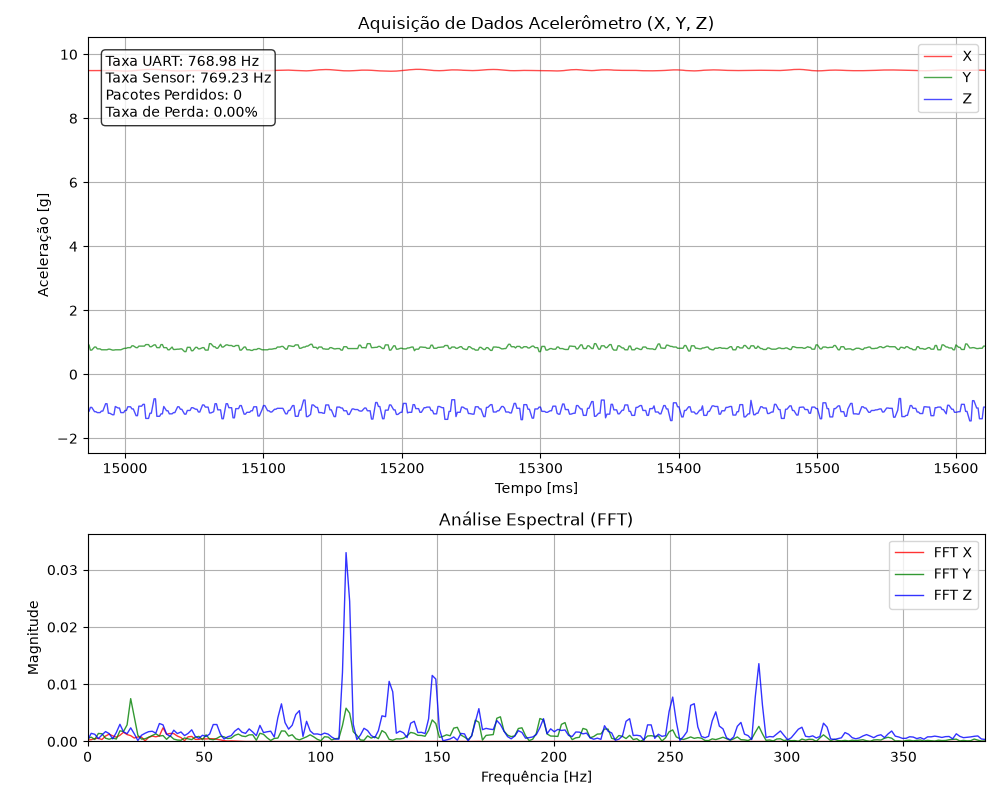

> [!NOTE]
> O _define_ `CONFIG_FXOS8700_MODE_ACCEL` utilizado para configurar o projeto no arquivo `prj.conf` ativa o sensor acelerômetro da placa, porém ele apresenta um nome diferente do sensor presente (o correto deveria se `mma8451q` e não `fxos8700`).
>
> O chip `mma8451q` que está na sua placa é apenas um acelerômetro. Algum tempo depois, a Freescale/NXP lançou um outro chip chamado `fxos8700`, presente na placa `frdm-k64f`. Esse chip mais novo é composto por um magnetômetro e um acelerômetro.
>
> O _Zephyr_ tinha um _driver_ separado só para o `mma8451q`. Porém, os desenvolvedores do sistema operacional removeram o drive já que o código do acelerômetro no driver do `fxos8700` é idêntico e oferece mais funcionalidades, removendo código duplicado, restando apenas as configurações do _Device Tree_ para a placa `frdm-kl25z`.
>
> ### _Commit_ da remoção:
>
> **3ad8431f ("Revert "samples: sensors: mma8451q: Add accelerometer sample"")**
>
> Driver fxos8700 can also be used for the MMA8451 accelerometer and offers more functionality. Revert the commit to avoid duplicate code.

### Análise do programa:

O funcionamento se divide em quatro partes principais: a aquisição de dados na função `accel_thread_data_acquisition()`, transmissão dos dados via UART na função `accel_thread_communication()`, implementação do filtro FIR na função `filter_fir()` e a implementação de um _script_ para realizar a leitura e visualização em tempo real dos dados.

1. Aquisição de dados

    A função `accel_thread_data_acquisition()` representa o _entry point_ da _thread_ de aquisição de dados. Inicialmente é feita a configuração do `ODR` (_Output Data Rate_) para definir a taxa de aquisição do sensor (valor máximo de **800 Hz**) e a configuração de um `timer` utilizado para limitar a taxa de busca de amostras entre o microcontrolador e o sensor, feito na função `sensor_sample_fetch()`. Isso evita a leitura de dados antigos e consequentemente repetidos. O valor de atraso do _timer_ é dado em microsegundos (**1250 $\mu$ s**, o que equivale a **800 Hz**), por isso foi definido `CONFIG_SYS_CLOCK_TICKS_PER_SEC=10000` no arquivo `prj.conf`, aumentando a precisão do relógio.

    A rotina contínua de aquisição dos dados é feita após as configuções, ela é composta de uma função que faz a sincronização das aquisições para limitar em **800 Hz**, `k_timer_status_sync()`, configurada pelo `timer`, que trava o laço na frequência correta. Em seguida, os dados são buscados por `sensor_sample_fetch()` e, em caso de sucesso, extraídos pela função `sensor_channel_get()`. Com os dados obtidos, o filtro FIR é aplicado (ou não) e os valores empacotado em um `struct` do tipo `data_packet_t`. Por fim, o pacote é adicionado em uma fila (se a fila estiver cheia, ela é limpa antes da inserção) para que a próxima thread realize o envio.

2. Transmissão dos dados via uart
    
    A função `accel_thread_communication()` representa o _entry point_ da _thread_ de transmissão de dados. Ela possui uma prioridade inferior à _thread_ de aquisição. Sua função é retirar os itens da fila de dados empacotados obtidos na aquisição e transmiti-los em formato binário, _byte_ a _byte_, usando a função `uart_poll_out()`.

    Os pacotes são compostos por um _header_ para validar o início transmissão (\$A), um número da sequência (para permitir a detecção de pacotes perdidos, isso iria ser feito de forma automática caso se utilizasse o sistema de _logs_ ou `printk()` para transmitir os dados, já que iria apresentar um erro caso perdesse algum dado), um _timestamp_ e os valores dos eixos x, y e z.

    ```C
    struct __attribute__((packed)) data_packet_t
    {
        uint8_t header[2];   // Marcador de início: '$' e 'A' (0x24, 0x41)
        uint32_t sequence;   // 4 bytes
        int64_t ts;          // 8 bytes
        int32_t x_val1;      // 4 bytes
        int32_t x_val2;      // 4 bytes
        int32_t y_val1;      // 4 bytes
        int32_t y_val2;      // 4 bytes
        int32_t z_val1;      // 4 bytes
        int32_t z_val2;      // 4 bytes
    }; // Total: 2 + 4 + 8 + (6 * 4) = 38 bytes
    ```

3. Implementação do filtro FIR

    A função que aplica o filtro FIR, `filter_fir()`, processa os dados no formato de ponto fixo utilizando inteiros (`int32_t`), visto que o microcontrolador não possui _hardware_ dedicado para cálculos em ponto flutuante (`float`). O sistema de ponto fixo utilizado segue o padrão do subsistema de sensores do Zephyr:

    ```C
    struct sensor_value {
        /** Integer part of the value. */
        int32_t val1;
        /** Fractional part of the value (in one-millionth parts). */
        int32_t val2;
    };
    ```

    Para manter os coeficientes do filtro no mesmo formato inteiro dos dados lidos, eles são previamente multiplicados por $1024$. Dessa forma, após a etapa de acumulação das multiplicações no filtro, basta deslocar os bits do resultado em $10$ posições para a direita ($\gg 10$), o que equivale a uma divisão rápida e eficiente por $1024$.

    Atualmente, o filtro está sendo aplicado apenas no eixo X, servindo como uma base de referência cruzada para comparar o sinal limpo com os resultados brutos dos outros eixos. Os coeficientes utilizados no código `C` foram gerados externamente através de um _script_ auxiliar em Python (`get_filter.py`).

4. Implementação do _script_
    Para validar e analisar o comportamento do sistema, foi desenvolvido um _script_ em Python utilizando as bibliotecas `pyserial`, `matplotlib` e `numpy`. Ele atua em duas frentes processando os pacotes binários recebidos via UART em tempo real:

    - Diagnóstico de Comunicação: O _script_ monitora os identificadores de sequência dos pacotes e os valores literais das medições para diferenciar a Taxa da UART (quantos pacotes o microcontrolador envia por segundo) da Taxa Real do Sensor (quantas vezes o acelerômetro efetivamente atualizou o dado físico), além de acusar imediatamente a porcentagem de pacotes perdidos no barramento.
    - Análise de Sinais (Domínio do Tempo e Frequência): O sistema exibe gráficos dinâmicos das acelerações (X, Y e Z) no domínio do tempo e aplica a Transformada Rápida de Fourier (FFT) com um janelamento de Hanning. Isso permite identificar visualmente os picos de ruído e as frequências de vibração dominantes em cada eixo, validando a eficácia do filtro FIR implementado no _firmware_.
    
### Análise do funcionamento:

#### Metodologia

A análise de funcionamento do sistema foi baseada em uma metodologia de testes dividida em três etapas principais.

1. Variação da Taxa de Aquisição

Para avaliar a estabilidade do sensor e do barramento I2C, a taxa de aquisição (`ODR`) foi variada enquanto a transmissão serial foi mantida com folga em **460.800 bps**. O filtro FIR permaneceu desativado.

| ODR Configurado (Hz) | Taxa UART Lida (Hz) | Taxa Sensor (Hz) | Pacotes Perdidos (%) |
| :--- | :--- | :--- | :--- |
| 50 | 770 | 65 | 0.00% |
| 100 | 770 | 125 | 0.00% |
| 400 | 770 | 513 | 0.00% |
| 800 | 770 | 769 | 0.00% |

**Análise:**

A taxa de aquisição do sensor conseguiu acompanhar o `ODR` configurado nos valores mais altos sem ter perdar de pacotes na transmissão.

---

2. Variação da Taxa de Transmissão

Neste teste, a taxa de aquisição do sensor foi fixada em **400 Hz**, porém o programa faz aquisições em  **800 Hz** por conta do _timer_, com isso
são 800 pacotes de 380 _bits_ por segundo (38 _bytes_ utilizando o padrão de 1 _start bit_, 8 de dados, 1 _stop bit_, cada _byte_ custa 10 _bits_ no barramento), logo exige no mínimo **304.000 bps**, e o *baud rate* foi reduzido gradativamente para observar o ponto de colapso da comunicação. O filtro FIR permaneceu desativado.

| Baud Rate (bps) | Taxa UART Lida (Hz) | Taxa Sensor (Hz) | Pacotes Perdidos (%) |
| :--- | :--- | :--- | :--- |
| 1.000.000 | 770 | 510 | 0.00% |
| 500.000 | 770 | 510 | 0.00% |
| 230.400 | 566 | 375 | 28.44% |
| 115.200 | 304 | 186 | 63.02% |


**Análise:**

A baixo do limite mínimo de **304.000 bps** a transmissão de dados começou a apresentar perdas de pacotes, apresentando o gargalo da transmissão nessa taxa de **800 Hz**.

---

3. Impacto do Filtro FIR

Com a comunicação estabilizada (`ODR` em **400 Hz**, porém aquisições em **800 Hz** e UART em **1.000.000 bps**), o filtro FIR foi ativado. O número de coeficientes foi variado para analisar o impacto das operações matemáticas na CPU.

| Coeficientes | Taxa UART Lida (Hz) | Taxa Sensor Real (Hz) | Pacotes Perdidos (%) |
| :--- | :--- | :--- | :--- |
| 31 | 766 | 769 | 0.00% |
| 63 | 769 | 769 | 0.00% |
| 127 | 737 | 737 | 0.00% |
| 255 | 605 | 606 | 0.00% |

**Análise:**

Após 127 coeficientes a placa começou a não conseguir entregar os 800 pacotes por segundo devido ao tempo gasto com os calculos, isso fica evidente quando se utiliza 255 coeficientes

Imagem exemplo para 63 coeficientes:

<p align="center">
  
</p>
